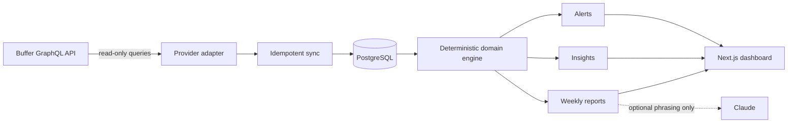

<div align="center">


<p>
  
  
  
  
  
</p>

<p>
  
  
  
  
</p>

**Know what needs attention, what is working, and what to test next — across every brand.**

</div>

---

## ✨ Overview

<table>
<tr>
<td width="60%" valign="middle">

**SocialRadar** — powered internally by **BrandPulse** — is a multi-brand operations and analytics platform for Instagram, TikTok, and YouTube accounts scheduled through Buffer.

It turns queues, publishing outcomes, and post-level metrics into **coverage alerts**, **fair performance comparisons**, **evidence-backed recommendations**, and **versioned weekly reports** in pt-BR.

The core promise is simple: **observe and recommend, never interfere**. The Buffer adapter rejects every GraphQL mutation, so existing publishing automations remain untouched.

</td>
<td width="40%" align="center">


</td>
</tr>
</table>

> [!IMPORTANT]
> SocialRadar is deliberately **read-only** on top of Buffer. It never creates, edits, deletes, reschedules, or publishes content, and reserves part of the shared API quota for your existing automations.

---

## 🚀 What it delivers

<table>
<tr>
<td width="50%" valign="top">

### 📅 Queue runway

See which account is about to run out of scheduled content, how many posts are missing, and the exact deadline for replenishment.

</td>
<td width="50%" valign="top">

### 🚨 Operational alerts

Detect empty queues, stale syncs, disconnected channels, overdue posts, and publication failures with dedupe, snooze, and escalation rules.

</td>
</tr>
<tr>
<td width="50%" valign="top">

### 📊 Fair analytics

Compare weeks at the **same post age**, preserve N/A semantics, and avoid mixing incompatible platform definitions or incomplete metric samples.

</td>
<td width="50%" valign="top">

### 🧠 Actionable insights

Turn format, content-pillar, timing, and consistency signals into hypotheses with evidence, confidence, a success metric, and an evaluation window.

</td>
</tr>
<tr>
<td width="50%" valign="top">

### 📄 Weekly reports

Generate immutable, versioned reports with deterministic narratives, preliminary-data warnings, and audited PDF/CSV exports.

</td>
<td width="50%" valign="top">

### 🏢 Multi-brand control

Map Buffer channels to brands, configure cadence per account, isolate every query by membership, and monitor the whole portfolio from one place.

</td>
</tr>
</table>

---

## 🏗️ How it works



The application is a **modular monolith**: one Next.js web process and one durable worker sharing PostgreSQL. Jobs are claimed with `FOR UPDATE SKIP LOCKED`, protected by dedupe keys, and retried with exponential backoff and jitter.

---

## 🛠️ Tech stack

| Layer | Technologies | Role |
| :--- | :--- | :--- |
| **Web** | Next.js 16 · React 19 · Tailwind CSS 4 · Recharts | Server-rendered product UI and charts |
| **Language** | TypeScript 5.9 · Zod 4 | Strict domain and boundary validation |
| **Data** | PostgreSQL 15+ · Drizzle ORM | Brand-isolated relational model and migrations |
| **Jobs** | PostgreSQL durable queue · TSX worker | Sync, alerts, insights, and weekly reports |
| **Provider** | Buffer GraphQL API | Queues, channels, posts, failures, and metrics |
| **AI** | Anthropic SDK · deterministic fallback | Optional narrative rewriting only |
| **Exports** | PDFKit · CSV | Versioned, audited report downloads |
| **Testing** | Vitest · PGlite | 281 deterministic and security-focused tests |

---

## 🎯 Product principles

| Principle | What it means in practice |
| :--- | :--- |
| **Read-only by design** | Mutation documents are rejected before reaching Buffer. |
| **Honest metrics** | Unsupported, missing, pending, and ambiguous-zero values remain explicit — never silently converted to zero. |
| **Fair comparison** | Lifetime counters are compared at a shared observation age, not at unequal “latest” ages. |
| **Evidence before advice** | Every recommendation stores its finding, sample, hypothesis, action, confidence, and success criterion. |
| **Deterministic first** | Reports work without AI; the model may improve wording but cannot alter facts, tables, or actions. |
| **Isolation everywhere** | Brand-scoped reads and downloads verify membership and return 404 for unauthorized identifiers. |

---

## 💻 Local setup

### Requirements

- Node.js **22.13.1** (`.nvmrc` included)
- npm
- No system PostgreSQL or Docker required for local development

```bash
# 1. Clone and enter the project
git clone https://github.com/Jeanfr1/socialradar.git
cd socialradar

# 2. Use the supported runtime and install dependencies
nvm use
npm install

# 3. Start embedded PostgreSQL (keep this terminal open)
npm run db:local

# 4. In another terminal, prepare the database
npm run db:migrate

# 5. Generate a credential-encryption key outside the repository
mkdir -p ~/.brandpulse
node -e "process.stdout.write(require('crypto').randomBytes(32).toString('base64'))" > ~/.brandpulse/kek
chmod 600 ~/.brandpulse/kek
echo "BRANDPULSE_KEK_FILE=$HOME/.brandpulse/kek" >> .env.local

# 6. Create the first owner and launch the app
BRANDPULSE_OWNER_PASSWORD='use-a-long-passphrase' npm run setup:owner -- --email you@example.com --name "You"
npm run dev
```

Open [http://localhost:3000](http://localhost:3000), create your brands, add each Buffer API key through **Settings → Connections**, and map the discovered channels. Run the worker in a third terminal:

```bash
npm run worker
```

> [!WARNING]
> Never add Buffer keys to `.env.local` or commit them. The server-side connection flow validates and encrypts provider credentials with AES-256-GCM before storage.

---

## 🔧 Commands

| Command | Description |
| :--- | :--- |
| `npm run dev` | Start the Next.js development server |
| `npm run build` | Generate the optimized production build |
| `npm run start` | Serve the production build |
| `npm run worker` | Run the durable scheduler and job worker |
| `npm run db:local` | Start embedded PostgreSQL for development |
| `npm run db:migrate` | Apply versioned Drizzle migrations |
| `npm run setup:owner` | Create the first workspace administrator |
| `npm run sync:now` | Trigger an immediate quota-aware sync |
| `npm run reports:run` | Generate all due weekly reports |
| `npm run seed:demo` | Add an isolated demo brand and fixture data |
| `npm run typecheck` | Validate the complete TypeScript project |
| `npm test` | Run all 281 tests |

---

<details>
<summary><b>📁 Project structure</b></summary>

```text
socialradar/
├── src/
│   ├── app/                     # authenticated UI, settings and report routes
│   ├── components/              # dashboard, charts, forms and state components
│   ├── domain/                  # pure coverage, metric, period and ranking rules
│   ├── server/
│   │   ├── actions/             # authenticated server mutations
│   │   ├── alerts/              # alert evaluation and lifecycle
│   │   ├── insights/            # evidence-backed recommendation engine
│   │   ├── providers/buffer/    # read-only GraphQL adapter and quota guard
│   │   ├── reports/             # facts, narratives, PDF and CSV generation
│   │   ├── security/            # credential encryption and redaction
│   │   └── sync/                # idempotent provider ingestion
│   └── worker/                  # scheduler and durable job runner
├── drizzle/                     # additive PostgreSQL migrations
├── scripts/                     # setup, imports, syncs and operational commands
├── tests/security/              # isolation, session and secret-leakage tests
└── docs/                        # product, metrics, operations and deployment guides
```

</details>

---

## 🔒 Security model

- 🔐 Provider credentials are encrypted with **AES-256-GCM envelope encryption**; the KEK stays outside the database and repository.
- 🧱 Every brand-scoped operation verifies membership and role on the server.
- 🫥 Unknown and unauthorized resource IDs both return **404**, preventing identifier probing.
- 🧼 Structured logging redacts secrets; tests assert that credentials never reach DTOs, reports, exports, logs, or AI prompts.
- 📝 Sensitive operations — connection changes, report regeneration, and downloads — are audited.
- 🛑 Buffer GraphQL mutations are rejected by the client, independent of UI behavior.

---

## 🧪 Quality gates

```bash
npm run typecheck
npm test
npm run build
```

Current baseline: **25 test files · 281 tests · 100% passing · production build clean**.

The suite covers domain calculations, quota handling, read-only provider enforcement, idempotent sync, durable jobs, alert escalation, recommendation thresholds, age-matched reports, AI fallbacks, PDF/CSV exports, authorization, brand isolation, encryption, password handling, session security, and secret leakage.

---

## 📚 Documentation

| Document | What's inside |
| :--- | :--- |
| [`docs/product/PRODUCT_SPEC.md`](docs/product/PRODUCT_SPEC.md) | User journeys, screens, states, and acceptance criteria |
| [`docs/CAPABILITY_MATRIX.md`](docs/CAPABILITY_MATRIX.md) | Live-verified Buffer capabilities and platform limitations |
| [`docs/METRIC_DICTIONARY.md`](docs/METRIC_DICTIONARY.md) | Definitions, formulas, N/A rules, and comparison policy |
| [`docs/REPORTS_AND_INSIGHTS.md`](docs/REPORTS_AND_INSIGHTS.md) | Report lifecycle, ranking, recommendations, and AI safeguards |
| [`docs/OPERATIONS.md`](docs/OPERATIONS.md) | Worker health, quota policy, backup, recovery, and incidents |
| [`docs/DEPLOYMENT.md`](docs/DEPLOYMENT.md) | Production architecture and release checklist |

---

## ⚠️ Known provider boundaries

Buffer does not expose follower/subscriber history, retention curves, CTR, or full account-level analytics for these connections. SocialRadar never invents those metrics. Audience growth requires future direct Instagram, TikTok, or YouTube integrations; the database already includes daily audience snapshots for that path.

See the [capability matrix](docs/CAPABILITY_MATRIX.md) for the verified field-by-field audit.

---

## 🚢 Deployment

Production uses two processes backed by the same managed PostgreSQL database:

1. **Web** — `npm run build && npm run start`
2. **Worker** — `npm run worker` on an always-on service

Set `SECURE_COOKIES=true` behind HTTPS, keep the KEK in a secret manager, run migrations once per release, and enable PostgreSQL point-in-time recovery. The complete procedure lives in [`docs/DEPLOYMENT.md`](docs/DEPLOYMENT.md).

---

## 📜 License

Private project — all rights reserved. © Jean Pereira.

---

<div align="center">

Built with precision, honest metrics, and ❤️ by [Jean Pereira](https://github.com/Jeanfr1)

<sub>SocialRadar sees the signal. Your team decides the move.</sub>

</div>
